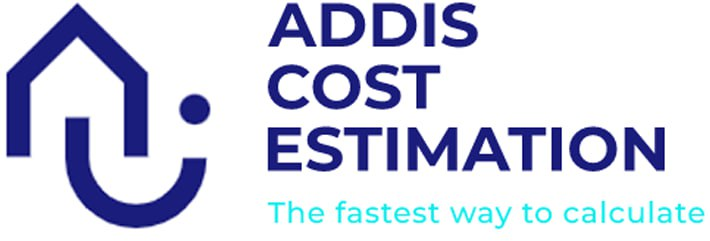

# Addis Building Cost Estimator

Building Cost Estimator is a web-based application built with Node.js that allows users to estimate the cost of their construction projects. Users can sign up, provide project information, and receive a cost estimation based on their input data. The application provides a convenient way for users to track and manage their project costs.

This project is a collaboration between three individuals, combining their civil engineering expertise with software engineering skills to create a comprehensive building cost estimation tool.

**Project Inspiration:** The Addis Building Cost Estimator was born out of a desire to simplify the process of estimating construction project costs. Our team recognized the challenges faced by individuals and organizations in accurately estimating the cost of construction projects. We wanted to create a tool that would empower users to plan and budget their projects effectively, leveraging our combined knowledge of civil engineering and software engineering.

Final Project Blog Article: [Read the Blog Article] (http://)

## Table of Contents

- [Introduction](#addis-building-cost-estimator)
- [Installation](#installation)
- [Usage](#usage)
- [Contributing](#contributing)
- [Contact](#contact)
- [Project Screenshots](#project-screenshots)

## Installation

To run the Addis Building Cost Estimator locally, follow these steps:

1. Clone the repository: `git clone https://github.com/Meacha1/portfolio-project.git`
2. Navigate to the project directory: `cd building-cost-estimator`
3. Install dependencies: `npm install`
4. Set up the database connection: Configure the database connection in the application's configuration file.
5. Start the application: `npm start`
6. Access the application in a web browser at `http://localhost:3000`

## Usage

1. Sign up for an account on the Addis Building Cost Estimator website.
2. Log in with your credentials.
3. Fill in the project information fields with the details of your construction project.
4. Click the "Submit" button to generate a cost estimation for your project.
5. You can update the project information anytime by navigating to the "My Projects" section and selecting the desired project.

## Contributing

We welcome contributions from the community to enhance the Addis Building Cost Estimator project. To contribute, please follow these steps:

1. Fork the repository.
2. Create a new branch: `git checkout -b feature/your-feature-name`
3. Make your changes and commit them: `git commit -m "Add your message here"`
4. Push your changes to your forked repository: `git push origin feature/your-feature-name`
5. Create a pull request to the main repository, explaining your changes and their purpose.

Please adhere to the project's coding style, maintain clear commit messages, and ensure proper testing of your changes.

## Contact

For any questions, feedback, or inquiries, please feel free to reach out to us:

- Meacha Tafa: [LinkedIn](https://www.linkedin.com/in/meacha-teshome/)
- Elphaz Bekele: [LinkedIn](https://www.linkedin.com/in/elphazshiferaw/)
- Eyob Wolde: [LinkedIn](https://www.linkedin.com/in/eyob-zewdu-283581b0/)

## Project Screenshots

)

